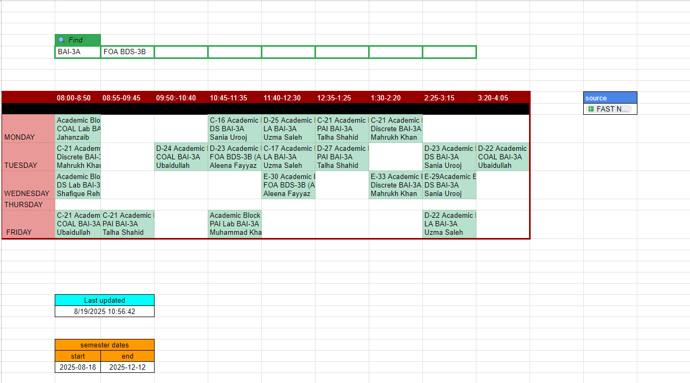
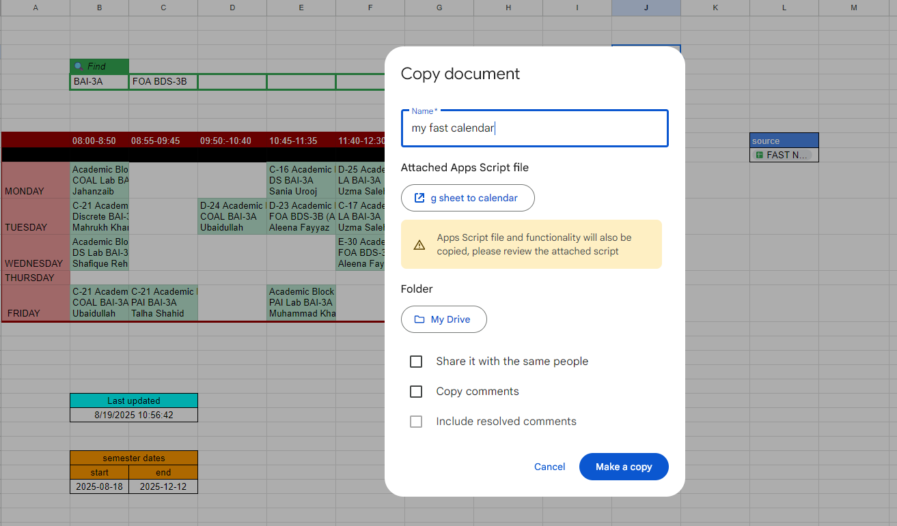
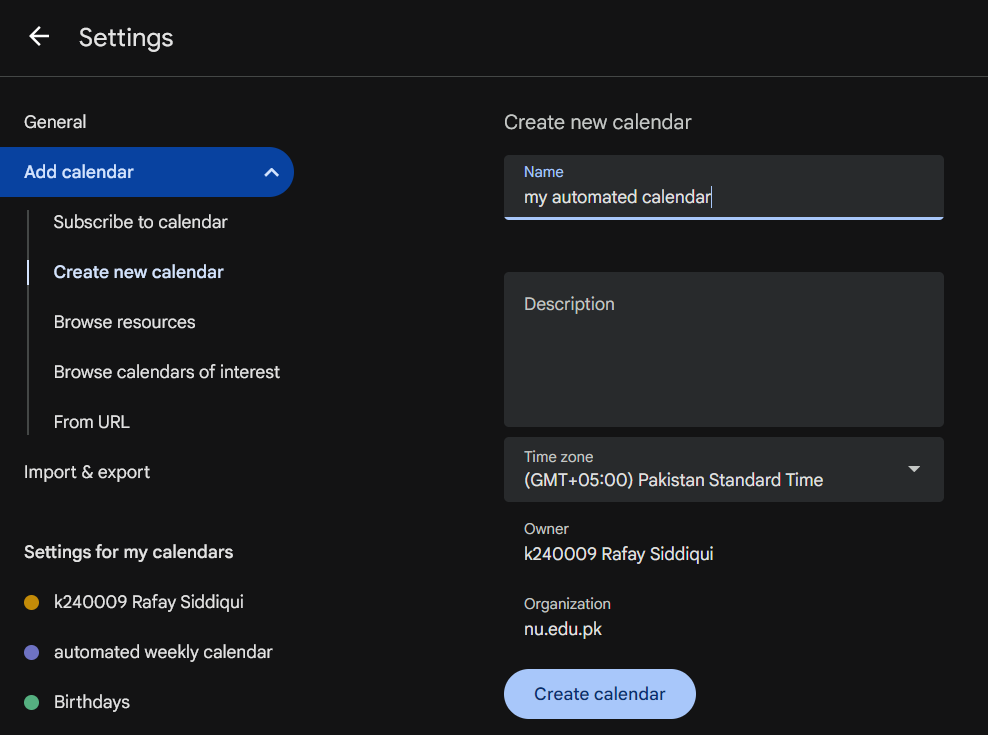
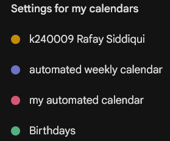
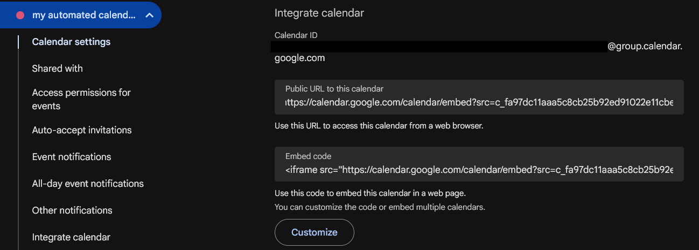
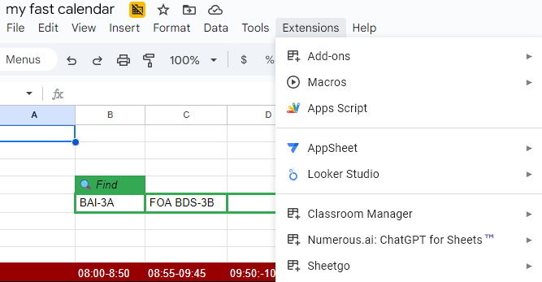
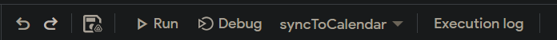
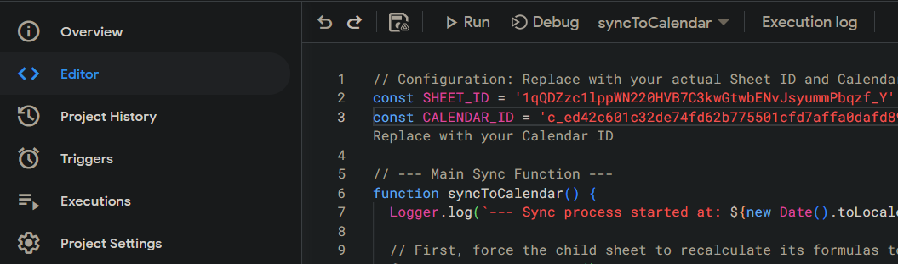
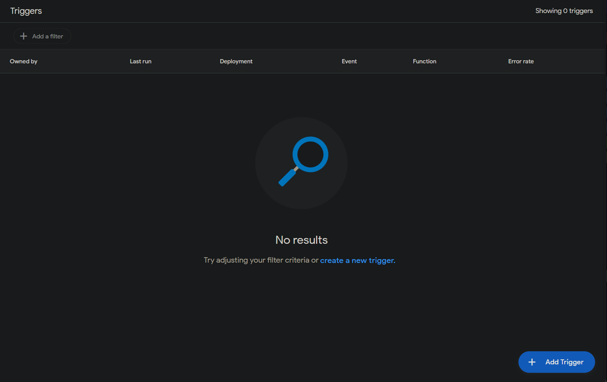

# FAST selfhosted timetable


## about

- alternative to 3rd party apps that might get unmaintained (you can simply just copy the sheet)
- filters your classes **directly** from the main timetable
- saves your query 
- manipulate to your liking

## getting started

- get it from [here](https://docs.google.com/spreadsheets/d/1tS3MANigEZKlMoJuJcROvijN5_4Y_A_dcVHz7wOVGoM/edit?gid=0#gid=0), goto `File > make a copy` to make it editable



- this might copy the attached 
- each cell holds a single query
- meaning, if you have electives that dont have your class name you will specify that in a different cell


>[!note] Example:
> `BAI-3A` and `FOA BDS-3B` to only fetch `FOA`


## limitations
- the sheet can not detect `merged cells`
  - hence classes like labs will only appear as once
- the `script` is made on ad-hoc basis, use it at your own risk


#  Calendar integration setup

- you can further add the slots to a google calendar
- allowing you to recieve notifications, automating your work

## features
-  events added are recurring, specified in the google sheets
-  can show other empty classes if your slot is empty 

## steps

### 1. create a google `calendar`

- open settings create new calendar



- it will show up on the left pane 



- go in the calendar's settings 
- move down to `integrate calendar`
- and get `calendar id`



> [!Note]
> keep this `calendar id` as the script wil use it as reference

### 2. extend the google `sheet`

- open your copied calendar's `extensions > Apps Script`



- this opens the associated `google script`

### 3. editing the google `script`

- open your `code.gs`
- these are the first few lines

``` js

// copy-paste this in script.google.com
// Configuration: Replace with your actual Sheet ID and Calendar ID
const SHEET_ID = '1qQDZzc1lppWN220HVB7C3kwGtwbENvJsyummPbqzf_Y'; // Replace with your Spreadsheet ID
const CALENDAR_ID = 'c_ed42c601c32dd74fd62b675501cfd7affa0dafd895a9e48422796bf6c0aa2fd0@group.calendar.google.com'; // Replace with your Calendar ID

// rest of code ...

```

- copy the sheet id from the sheet link

- `https://docs.google.com/spreadsheets/d/1tS3MANigEZKlMoJuJcROvijN5_4Y_A_dcVHz7wOVGoM/edit?gid=0#gid=0`

this part: `1tS3MANigEZKlMoJuJcROvijN5_4Y_A_dcVHz7wOVGoM`

- paste the aforementioned calendar id


> [!warning]
> copy your own `calendar id` and `sheet id`  to prevent any bugs

### 4. run the script

- will be present in the header

- make sure the `syncToCalendar` function is selected

### 5. add triggers

- allows the google calendar to auto update
- meaning, no need constantly visit `script.google.com`
- open the `triggers` in the left pane



- `add a trigger` at the bottom right 



- now add a trigger of your own choice,
- the trigger can be `time-driven` or `event-driven`


